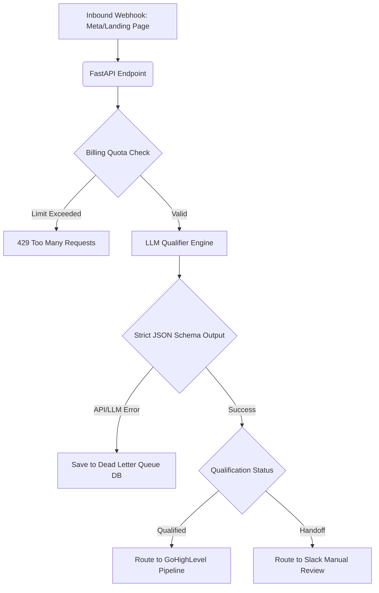

# High-Reliability Lead Qualifier (AI Wrapper)

A production-grade AI Wrapper microservice that acts as a "Zero-Fault Webhook Catcher". It receives inbound leads from Meta Ads, Landing Pages, or forms, strictly qualifies them using an LLM, manages API billing/costs, and ensures zero data loss using a Dead Letter Queue.

## Architecture & Features

- **Strict Structured AI Output**: Utilizes Pydantic schemas via `litellm` to guarantee the LLM outputs perfect JSON qualification metrics (Urgency Score, Estimated Capital, etc.). Never breaks downstream pipelines.
- **Billing & Cost Management**: Implements an SQLite tracking layer (`billing.db`) that limits the number of requests per client ID, simulating Freemium/SaaS monetization strategies for AI tools.
- **Dead Letter Queue (DLQ)**: If the LLM engine fails, the webhook payload is safely stored in an SQLite Dead Letter Queue (`failed_leads.db`).
- **Any-AI Provider Support**: Uses `litellm` so you can plug in OpenAI, Anthropic, or even run entirely offline via Ollama.
- **Visual Webhook Testing UI**: Comes with a built-in interactive simulator accessible via the browser to visually test how the AI engine qualifies leads.

## Workflow Diagram



## Quick Start

1. **Install Dependencies**
   ```bash
   pip install -r requirements.txt
   ```

2. **Configure Environment**
   Rename `.env.example` to `.env` and set your preferred AI provider key:
   ```env
   LLM_MODEL=gpt-4o-mini
   LLM_API_KEY=sk-your-openai-api-key
   ```

3. **Run the Server**
   ```bash
   python -m src.main
   ```

4. **Test the UI**
   Open your browser to `http://localhost:8000` to interact with the Glassmorphic Simulator Frontend. Submit a test lead to see the AI qualification in action!

## Project Structure
- `/src/api` - FastAPI Routing endpoints
- `/src/ai` - LLM interaction using Litellm and Pydantic Structured Outputs
- `/src/core` - Core Pydantic Models defining the exact data shapes
- `/src/services` - Billing quota engine & Dead Letter Queue (SQLite)
- `/src/frontend` - HTML/CSS for the testing interface
